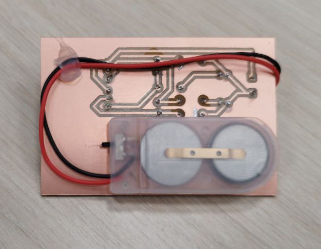
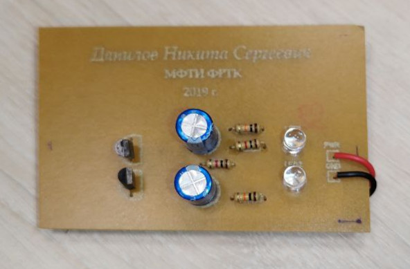

== Сборка

На данном этапе осталось только с помощью паяльника припаять компоненты на их размеченные места, приклеить батарейки с обратной стороны и проверить работу платы.

Получившееся устройство можно использовать по назначению.