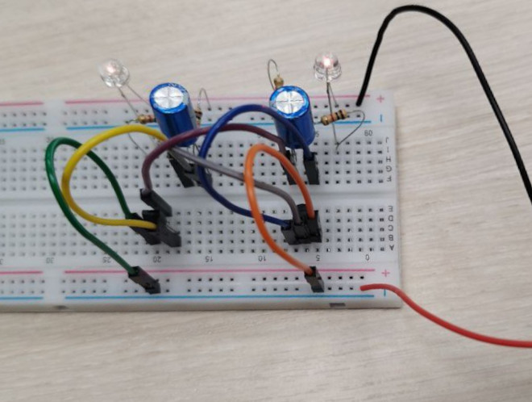

== Натуральное моделирование

После проверки работоспособности платы в виртуальной среде необходимо проверить её работоспособность в реальном мире.

Для этой цели на макетной плате собран аналог системы из этапа виртуального моделирования.

На этот раз удалось получить эффект мерцания, а значит можно приступать к следующему этапу xref:shema.adoc[разработки схемы].