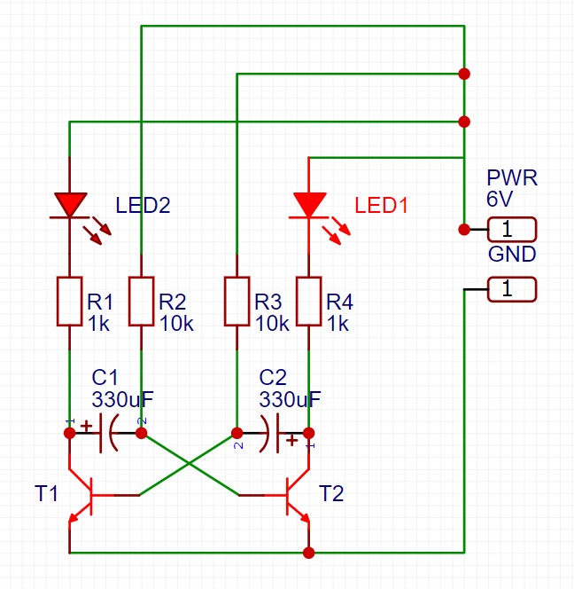

== Разработка схемы

Для создания электрической платы сперва необходимо создать её виртуальную схему.

Для этой цели в программе https://easyeda.com/[EasyEDA] была создана следующая схема.

Схема, собранная в этой программе позволяет впоследствии создать макет печатной платы с нужными посадочными местами для компонентов.

Приступим к xref:plata_teor.adoc[разработке печатной платы].